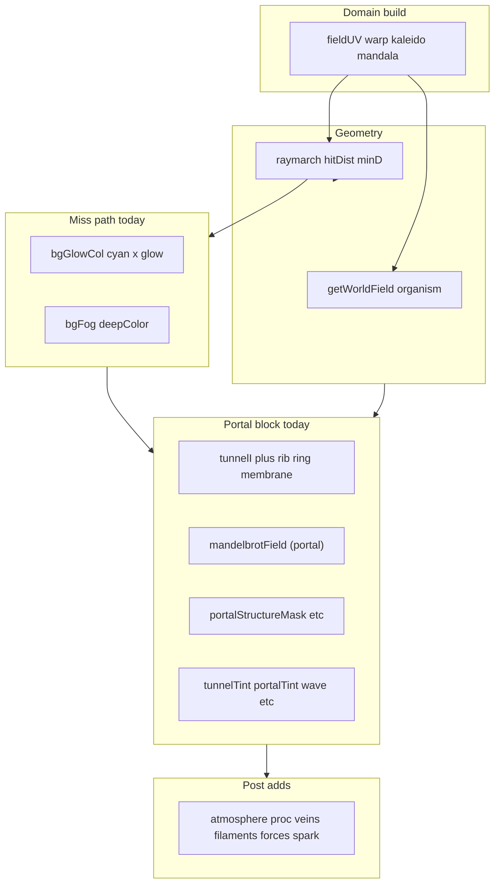

# Portal organism composition (shader-only)

## Review: what creates the three reads today

### 1) Large blue outer / “petal” background
- **Miss-branch volumetric base** ([`psychedelic.frag` lines 1118–1142](src/shaders/psychedelic.frag)): `bgGlowCol` is `zoneColor(..., vec3(0.00, 0.92, 1.00), ...)` multiplied by a wide `glow = exp(-minD * 1.58) * ... * (0.46 + internalGlowMask * 1.08)`. `minD` is small over large regions near the blob miss cone, so **cyan fills the frame** before tunnel correction.
- **Kaleido / mandala / spiral on `fieldUV`** ([~750–792](src/shaders/psychedelic.frag)): large-scale symmetry in domain space feeds every later sample; visually reads as “lobes” once tinted **cyan** by the paths above and tunnel tints below.
- **Unified tunnel tint pass** ([`tunnelTint * tunnelI * tunnelBlobMask`, ~1348](src/shaders/psychedelic.frag)): on miss, `tunnelBlobMask` still has a **~0.18 floor** plus `edgeProximity` terms (~1342–1344), so **tunnel cyan can add outside the strong throat ring** even when portal anatomy masks are weak.
- **Atmosphere + vortex lattice** ([~1366–1364](src/shaders/psychedelic.frag)): `atmosphereColor` uses a bright aqua anchor; `vortexLattice` adds another **full-field cyan** term gated mainly by `neuralBloom` / tunnel polar windows, not by a single anatomy scalar.

### 2) Central mushroom / blob surface (“beige clay”)
- **Hit branch** ([~959–1116](src/shaders/psychedelic.frag)): `surfaceBase` mixes `violetFlesh`, `foldCol` (`deepColor`), `membraneCol` (warm anchor `vec3(1.00, 0.48, 0.10)`), `acidAccent`, and `coolMembrane` (`vec3(0.02, 0.78, 0.92)`), with **`broadShellMask * coolMembrane`** and **`coolMembraneMask`** pushing **cool/teal on outer shell** vs warm membrane—reads as a **separate object** vs the tunnel’s `tunnelTint` / `portalTint` stack (dominant cyan–gold) added **after** the surface is finalized.

### 3) Where throat / rib / gill / membrane become final colour
- **Tunnel intensity** is built in **two places**: `tunnelI` from `tunnelLayer` ([~1180](src/shaders/psychedelic.frag)), then **re-incremented** with ribs/rings/membrane/wall cells ([~1320–1326](src/shaders/psychedelic.frag)).
- **Portal / Mandelbrot routing** gates structure via `portalStructureMask`, `anatomyThroatGate`, `mandelRibs`, `mandelRings`, `mandelMembrane`, `mandelLattice`, `fractalMacroContour`, `fractalMesoLattice`, `membraneAnatomyMask`, `ringDepthBreak` ([~1228–1287](src/shaders/psychedelic.frag)).
- **Final compositing** ([~1346–1364](src/shaders/psychedelic.frag)): void darken then additive tunnel tints, portal bloom, trap-routed colours, growth wave, fluid lift, vortex lattice.

### 4) Weakly gated / full-frame colour adds (candidates to trim or gate)
- Miss `bgGlowCol * glow` (wide footprint).
- Tunnel tint with **miss `tunnelBlobMask` floor**.
- **`atmosphereColor * atmosphereMask`**** ([~1375–1378](src/shaders/psychedelic.frag)): `proximityMist * screenHazeMask` path can read as independent haze.
- **`col += forceColor * ...`**, **mouse ripple**, **`sparkColor`** ([~1453–1466](src/shaders/psychedelic.frag)): mostly screen-local or anatomy-scaled but still worth **toning** if they reintroduce “overlay” after your authority pass.
- **`procMask` procedural add** ([~1398–1405](src/shaders/psychedelic.frag)): `localMask` on miss uses proximity + environment/throat—better than uniform, still **fieldy**.



## Constraint: `portalAnatomyAuthority` before miss demotion

Today **miss `col` is built before** `portalStructureMask` / `anatomyThroatGate` / Mandelbrot-derived masks exist (order: miss at 1118–1142, tunnel block from 1145). **No extra `mandelbrotField` sample** means: **do not compute portal masks twice**.

**Required structural change (single shader reorder, no new passes):**
1. Build `hitCol` / `missCol` in the `if (hitDist > 0.0)` / `else` branches into **temporary vec3** (or assign `hitCol`/`missCol` then merge).
2. Move the entire **“Tunnel / portal depth layer”** subsection ([from ~1145 through just before atmosphere at ~1366](src/shaders/psychedelic.frag)) to run **immediately after** the hit/miss merge **before** `atmosphereMask` / subsurface / proc / veins / filaments / forces / spark (those stay as “post” but gain optional authority weights).
3. Merge base colour as:
   - `vec3 col = hitDist > 0.0 ? hitCol : missCol;`
   - Compute **`portalAnatomyAuthority`** from **existing scalars only** in that moved block (same `mandelbrotField` portal call as today).
   - Apply **miss-only demotion**: `if (hitDist <= 0.0) col *= mix(outerDimMin, 1.0, pow(portalAnatomyAuthority, gamma));` so wallpaper is crushed where masks are weak **before** tunnel stack re-adds structured cyan.
4. Run **void multiply + tunnel adds** on `col` exactly as today (same formulas), optionally **scalar-multiplying** the most wallpaper-like tunnel lines on miss by `(lerp(missTunnelMul, 1.0, portalAnatomyAuthority))` if throat still competes after step 3.

`organism` at the point of the moved block is already correct: hit branch updates it at [~963](src/shaders/psychedelic.frag); miss keeps the screen-space sample from [~950](src/shaders/psychedelic.frag). `anatomyThroatGate` in the moved block therefore matches today’s tunnel composite.

## `portalAnatomyAuthority` — concrete implementation target

Compute **once** per fragment after the existing portal mask chain (same order as today: `anatomyThroatGate`, `portalStructureMask`, `ringDepthBreak`, `fractalMacroContour`, `fractalMesoLattice` are all available **before** any colour that should be gated).

**Baseline weighted sum** (exact idea; variable names in shader may differ):

```glsl
float portalAnatomyAuthority = clamp(
    portalStructureMask * 0.35 +
    anatomyThroatGate     * 0.25 +
    ringDepthBreak        * 0.18 +
    fractalMacroContour   * 0.14 +
    fractalMesoLattice    * 0.08,
    0.0, 1.0
);
```

**Shaping / hierarchy (Book of Shaders–style):** treat the raw sum as a value to **remap**, not only linearly multiply. Prefer `smoothstep(low, high, portalAnatomyAuthority)`, `pow(x, k)` with `k > 1` to **delay** loudness until structure is strong, or a short `mix` of two smoothsteps so midground emerges before background “petals” speak. Goal: **thresholds and curves** so foreground throat → mid membrane → outer field read as **priority levels**, not everything visible at once.

**Do not** add new samples; only algebra on existing intermediates.

## Gating map (loudness belongs to the portal body)

Nothing visually loud unless `portalAnatomyAuthority` supports it. Map user intent to shader regions (exact names will differ):

| Intent | Likely shader locus | Gate pattern (idea) |
|--------|---------------------|---------------------|
| Background petals / miss field | `missCol` before tunnel stack; any kaleido-tinted miss accumulation | `*= mix(0.18, 1.0, portalAnatomyAuthority)` (or shaped variant) |
| Big blue glow | `bgGlowCol * glow` in miss branch | `*= mix(0.25, 1.0, portalAnatomyAuthority)` |
| Mandelbrot as **tissue tint**, not wallpaper | Adds using `mandelPortalTint` (membrane / ribs / rings lines) | `*= mix(0.35, 1.0, portalAnatomyAuthority)` on those **colour contributions** or on their scalars before multiply |
| Micro lattice / pin glints | `mandelLattice` path (`portalAcid * clamp(mandelLattice,…)`) | `*= portalAnatomyAuthority` (or `pow(authority, 1.2)`) so glints **only** live on structure |
| Atmosphere / vortex cyan sheet | `atmosphereColor * …`, `vortexLattice * …` on miss | Multiply miss contribution by `mix(low, 1.0, authority)`; keep hit path subtle |

**Sacrifice:** accept **less** big blue background beauty for **coherence** — outer blue becomes **dim outer membrane folds**, not main psychedelic petals.

## Key visual decisions (non-negotiable direction)

1. **Outer blue** — Dim, desaturated **membrane folds** tied to tunnel/ring phase and authority; **never** competing wallpaper.
2. **Center** — **Translucent portal tissue** wired to tunnel/deep palette and throat/rim gates; **not** a separate beige blob (reduce isolated warm shell; increase lerp from tunnel/deep anchors on grazing and outer shell).
3. **Mandelbrot** — **Growth logic inside tissue**, not a visible decorative pattern layer: **lower** contrast of trap-driven colour where authority is weak; avoid “improving the pattern”; **improve the organism** (gate tints, possibly slightly stronger void/attenuate where `inside` reads as pattern sheet — without new samples).

## Patch direction (by user bullets)

1. **Demote independent background motifs** — Implement **`portalAnatomyAuthority`** with the **weighted clamp** above (optionally wrapped in `smoothstep` / `pow` for hierarchy). Miss path: apply **`mix(0.18, 1.0, authority)`**-style factors to accumulated miss colour before tunnel stack; tighten **miss** `tunnelBlobMask` floor (~0.18) toward `portalMask` / `tunnelI` so cyan does not fill the miss cone without structure.
2. **Single composition authority** — Same scalar drives **blue glow** (`mix(0.25, 1.0, …)`), **`mandelPortalTint` contributions** (`mix(0.35, 1.0, …)`), **micro shimmer / lattice** (`*= authority`), plus **atmosphere** / **vortexLattice** / **proc** on miss per gating table.
3. **Pull central object into tunnel palette** — Inside hit branch, introduce a **pre-computed** `vec3 throatFieldTint = mix(tunnelDeep, tunnelTint, smoothstep(… tunnelI …))` is impossible before tunnel exists—**after reorder**, `tunnelTint` / `tunnelDeep` exist before hit branch… They are currently declared *inside* the moved block after `tunnelI`. Two options (pick one in implementation, both shader-only):
   - **A (preferred after reorder):** Forward-declare or move **`tunnelTint` / `tunnelDeep` / `portalGold`** computation to immediately after `tunnelI` smoothing, **before** hit/miss by duplicating the hue math only (no extra texture)—still just zoneColor on scalars; **or**
   - **B:** Lerp surface `surfaceBase` / `foldCol` / shell `coolMembrane` toward **`zoneColor` picks that share tunnel anchors** (`vec3(0.00, 0.90, 1.00)` family + `portalGold`) using `throatZone`, `rimZone`, `organism.throat`, and `viewSoft` for translucency—without reading `tunnelTint` early.

   Goal: **less isolated beige/warm cap**, more **subsurface tunnel colour** on grazing and outer shell (`broadShellMask` path).

4. **Blue petals → outer membrane folds** — Couple `missCol` cyan to **`ringDepthBreak`**, `polarT.x` throat–rim relationship, and **`portalMask`**; reduce saturation via `mix(col, luminance, … * (1.0 - authority))` rather than additive brightening.
5. **Depth hierarchy** — Use existing `depth01`, `polarT.x`, `portalMask`, `organism.throat`, **and** `portalAnatomyAuthority` so outer field **supports** central throat: stronger smoothstep near throat opening, softer far `polarT.x` on miss path.

6. **Trim decorative full-screen adds** — Specifically lower caps or multiply by `portalAnatomyAuthority` on miss for: **atmosphere**, **vortexLattice cyan line**, **proc** where `localMask` is driven by proximity without tunnel mask, and re-check **force / mouse** amplitudes if they read as overlays (small scalar edits only).

## Verification

- Run `npm run lint` and `npm run build` after edits (single file expectation: [src/shaders/psychedelic.frag](src/shaders/psychedelic.frag)).
- Visual: miss path should lose **full-frame cyan wallpaper**; outer kaleido lobes become **dim folded tissue** locked to tunnel phase; surface should pick up **tunnel hue** at rim/throat and read **more translucent**, not brighter.

## Risks / tuning notes

- Reordering is **mechanical but error-prone** (GLSL scope: `silhouetteSoft`, `hitDist`, `organism`, `tunnelBlobMask`); merge carefully so hit normals / `silhouetteSoft` are still defined before any line that references them.
- Avoid increasing `saturationNeon` multipliers on `tunnelTint`; user explicitly asked not to brighten overall.
